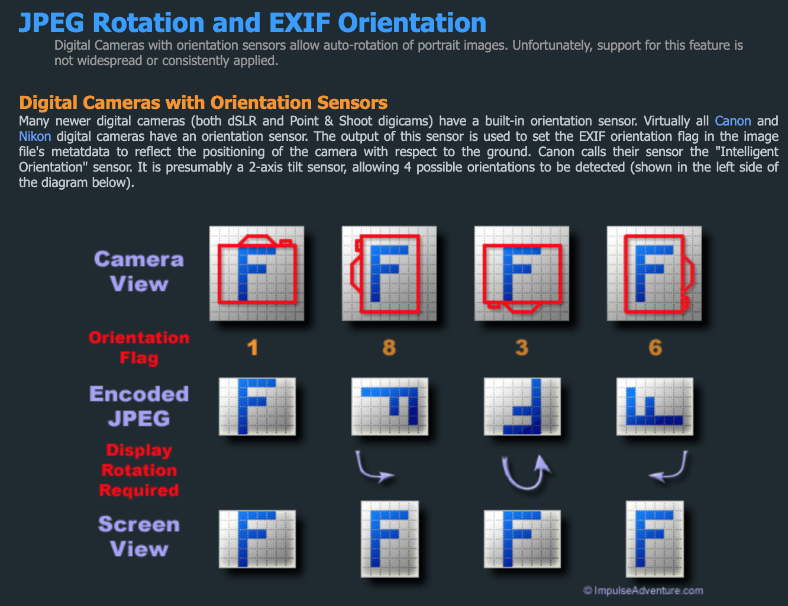
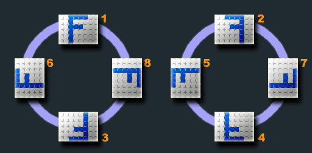

# image orientation 浏览器是如何确定图片展示方向的

同样一张图片，不同相机拍摄后的保存方式有差异，不同平台系统的浏览器中展示方向也有区别。本文从手机拍摄方向、保存照片方式、浏览器展示3个方面展开探究。

## 问题

有个用户上传的照片，预览时是横的，用户反馈我们的展示有问题。  
测试发现，在苹果手机查看是竖的，在安卓手机查看是横的，用户手机为安卓系统。  
查看该照片的EXIF信息得知，`orientation`为`90 CW`。  
使用OPPO R15和华为拍照测试，一直没有复现用户拍出来的情况，该用户手机机型为vivo iQOO

## 手机拍摄方向

平常拍照时持手机的方向大致有这两个区分：垂直于地面、与地面水平，手机横置、手机竖置，再加上介于垂直水平之间，按这样组合起来，情况是比较多的，但实测发现，手机有自己认为的正方向，同样是水平横置，拍出的照片可以是横的也可以是竖的。观察相机视口指示（如倍数、美颜、设置）的方向，这就是相机认为的正方向，可以猜测这是根据重力感应来确定的。其次，也可以打开照片的水印，拍摄后观察水印文字的方向，这与拍摄时指示的方向是一致的。
结论是：

1. **手机是根据重力感应来确定拍摄方向的，可以从拍摄指示观察到当前感应的拍摄方向。**
2. **根据上一条，拍摄方向只有4种。**

## EXIF：手机如何保存照片

### EXIF

EXIF是可交换图像文件格式 (Exchangeable image file format，简称Exif)，它记录了照片的附属信息和拍摄数据，如拍照方向、相机设备型号、拍摄时间、ISO感光度、GPS地理位置等数据。

[Exif 维基百科](https://zh.wikipedia.org/wiki/Exif)

- Exif有些信息不暴露给用户，可以通过工具/软件查询
- Exif信息是可以被修改或清除的

### 照片是如何保存的

下图表示拍摄方向与JEPG保存方式的关系。

相机4个拍摄方向，照片`EXIF orientation`对应为

Orientation | 1 | 8 | 3 | 6
 -- | -- | -- | -- | --
照片方向 | 上 | 右 | 下 | 左
展示需旋转 | - | 90 逆时针 | 180 | 90 顺时针

- 可以知道，拍摄方向表示了照片方向，将按此保存图片像素，并将拍摄方向记录到`EXIF的orientation`中。
- 实测知，不同手机对拍摄方向的记录有两种处理：
  1）以拍摄方向保存照片像素，并记录拍摄方向到orientation中，
  2）以旋转到方向为1的时的样子保存照片像素，并修正`orientation`为1

### 图片的变换

## 浏览器如何展示照片

理想的展示方式是，根据图片原始像素，读取`orientation`并按其值旋转照片。

而实际上，浏览器的这个能力受到系统平台的限制。一张`orientation`为6的照片，实测情况如下

理想：表示会根据orientation旋转图片
现实：表示只按原始像素展示图片，未根据orientation做旋转

平台 | Mac | IOS | Android |
 -- | -- | -- | -- |
 Chrome | 理想 | 理想 | 现实
 微信浏览器 | - | 理想 | 现实

## 相关链接

[Exif 维基百科](https://zh.wikipedia.org/wiki/Exif)
[exif.js 读取图片文件EXIF元数据的Javascript库](https://github.com/exif-js/exif-js)  
[在线工具-读取图片的EXIF信息](http://metapicz.com/#landing)
[exif-orientation图解](https://www.impulseadventure.com/photo/exif-orientation.html)
